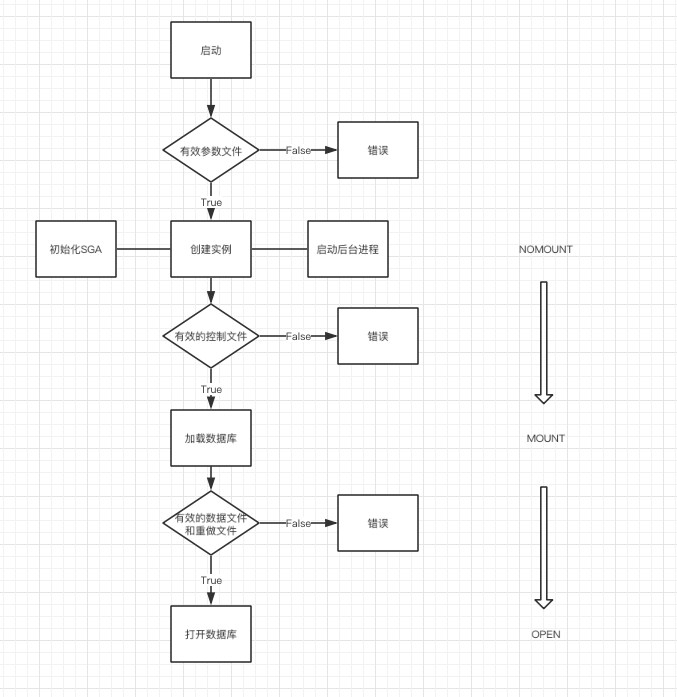

# OCP/OCA认证考试指南全册 11g

[TOC]

## 前言

#### DBA认证

1. Certified Associate (OCA)
2. Certified Professional (OCP)
3. Certified Master(OCM)

#### 书本结构

1. 第一部分：安装oracle软件和创建数据库的基本知识
2. 第二部分：SQL语句
3. 维护（备份和调整等内容），更高级的数据库功能

## 第I部分 Oracle Database 11g 管理

### 第一章 Oracle Database 11g 体系结构概述

内容：

解释内存结构

描述进程结构

讲述存储结构

#### 1.1 Oracle 产品系列

##### 1.1.1 Oracle服务器系列

| 数据库服务器   |
| -------------- |
| 应用服务器     |
| 企业管理服务器 |

1. 数据库服务器 ——用于存储数据

* 实例：

  * 一组进程和内存结构
  * 存在于CPU上和服务器节点上的内存中，可以启动和停止
  * 数据库的用户针对实力建立会话，由实例管理对数据库的所有访问

* 在oracle环境中，任何用户都绝对不可能直接联系数据库。连接Oracle数据库的Oracle实例构成Oracle服务器

* Oracle服务器实现的处理模型是**客户端—服务器**处理模型，通常称为两层（two-tier）模型

  * 客户端—服务器模型中，用户界面以及许多应用程序逻辑的生成都独立于数据管理

  * 客户端—服务器分离：通常由局域网来划分这两层，用户进程和服务器进程之间使用Oracle专有网络通信协议——Oracle Net

    

  * 客户端层：用户和进程

  * 服务器层：服务器进程（执行SQL）、实例、数据库

  * 会话：与服务器进程通信的用户进程

  * 登录和注销周期：每个用户有一个用户进程，每个用户进程有一个服务器进程。组成会话的用户进程和服务器进程由用户按需求启动，当不需要时就终止。

  * 数据库启动和关闭周期：数据库管理员启动和终止实例进程和内存结构

2. 应用服务器

应用服务器允许用在集中位置运行的应用程序替代传统上安装在最终用户计算机上的客户端软件。

| Web应用程序通常在三层或三层以上的体系结构中运行 |                                           |
| ----------------------------------------------- | ----------------------------------------- |
| **数据库层**：                                  | 管理数据访问                              |
| **应用程序执行层**：                            | 执行生成用户界面和数据库SQL调用的程序逻辑 |
| **客户端层**：                                  | 处理与用户通信的本地窗口管理              |


3. 企业服务器

| Oracle Enterprise Manager 三种形式 |                                        |
| ---------------------------------- | -------------------------------------- |
| Data Control                       | 管理数据库的图形界面                   |
| Application Server Control         | 管理一个或多个应用服务器实例的图形界面 |
| Grid COntrol                       | 全局化管理环境                         |


##### 1.1.2 Oracle 开发工具

1. 内部语言	

| 内部语言 |
| -------- |
| SQL      |
| PL\SQL   |
| Java     |

2. 外部语言

   用于开发在数据库外部进行的客户端—服务器应用程序

   * 胖Java客户端

   * 瘦Java客户端

3. Oracle Developer Suite


##### 1.1.3 Oracle应用程序

| Oracle 应用程序            |                             |
| -------------------------- | --------------------------- |
| Oracle E-Business Suite    | 基于账务处理引擎的应用程序  |
| Oracle Collaboration Suite | 办工自动化工具 1.2 预备知识 |

#### 1.2 预备知识

安装和使用Oracle数据库所需了解的基本概念

##### 1.2.1 Oracle概念

Oracle Database Server 两个主要组件

| 组件       | 描述                                     |
| ---------- | ---------------------------------------- |
| 实例组件   | 启动时初始化的一组操作系统进程和内存结构 |
| 数据库组件 | 用于数据存储和数据库操作的物理文件       |

Oracke与数据库交互的工具

| 工具                                     | 描述                       |
| ---------------------------------------- | -------------------------- |
| OUI（Oracle Universal Installer）        | 安装和删除Oracle软件       |
| DBCA（Database Configuration Assistant） | 用于创建、修改和删除数据库 |
| SQL*PLUS 和 SQL Developer                | 为编写和执行SQL提供接口    |


##### 1.2.2 SQL概念

介绍表、行、列和基本的SQL查询

* 表、行和列
  * Oracle Server 本身的数据存储在一组特殊的叫做数据字典的表中（TABLE_NAME, CIMMENTS）关系表遵循一些用于约束和定义数据的规则。
  * 在列级别，每列必须是某种数据类型。
  * 在行级别，每行通常有某种能唯一进行标识的特性
* 基本查询
  * 第II部分详细讨论

##### 1.2.3 操作系统概念

磁盘空间的两个主要使用者

| Oracle 程序文件（Oracle 二进制文件） |
| ------------------------------------ |
| Oracle 数据库数据文件                |


#### 1.3 单实例体系结构

|   组成   |
| :------: |
| 内存结构 |
|   进程   |

* 实例的生命周期就是其在内存中存在的时间：可以启动和停止它

* 在操作系统提供的共享内存段实现的内存结构称为**内存全局区（system global area, SGA）**。SGA在实例启动时分配，在关闭时释放。

* 服务器进程有时称为前台进程（与构成市里的后台进程相对）。与每个服务器进程相关的是一个非共享内存区，即**程序全局区（program global area， PGA）**。与系统全局区不同（可用于所有前台和后台进程），此区是会话专用的。

* 11g的内存管理可完全自动完成：DBA只需指定SGA和PGA总体的内存分配，并让Oracle按其认定的最佳方式管理内存。DBA也可以自己控制内存分配。

* 构成Oracle数据库的物理结构

  | 结构     | 描述                                                      |
  | -------- | --------------------------------------------------------- |
  | 数据文件 |                                                           |
  | 重做日志 | 对应用于数据的所有变更向量（change vector）的一系列的记录 |
  | 控制文件 | 存储数据库物理结构的详细信息。是链接到逻辑结构的起点      |

> 总结，单实例数据库的体系结构由4个交互组件构成
>
> | 交互组件描述             |
> | ------------------------ |
> | 用户与用户进程交互       |
> | 用户进程与服务器进程交互 |
> | 服务器进程与实例交互     |
> | 实例与数据库交互         |


##### 1.3.2 分布式系统体系结构

分布式系统中，组合实例与数据库的主要方式

| 名称                                                 | 属性                             |
| ---------------------------------------------------- | -------------------------------- |
| 实时应用群集（Real Application Clusters， **RAC** ） | 多个实例打开一个数据库           |
| 流                                                   | 多个Oracle服务器相互之间传播事物 |
| 数据保护                                             | 主数据库更新备用数据库           |

1. 实时应用群集（RAC）

可以通过配置RAC来获得100%正常工作时间。

一个实例可能出现故障，通过另一台计算机上的实例，用户仍然可以访问数据库。

2. 流  

将数据从一个数据库传输到另一个数据库。

原因：

* 容错
* 可以将两个数据库配置成执行不同类型的工作，如事务处理数据库和数据仓库

3. 数据保护

主数据库执行事务，备用数据库用于容错或处理查询

备份数据库从主数据库的备份实例化，并使用有所有应用于主数据库的更改进行

#### 1.4 实例内存结构

Oracle实例由称为系统全局区（SGA）的共享内存块以及大量的后台进程构成

> SGA 至少包含三种数据结构
>
> * 数据库缓冲区缓存
> * 日志缓冲区
> * 共享池
> * 还可能包括：
>   * 大池
>   * java池
>   * 共享池


> 每个会话都有自己专用的PGA


##### 1.4.1 数据库缓冲区缓存

数据库缓冲区缓存是Oracle用来执行SQL的工作区域

更改和查询时，首先复制数据块到缓冲区，对副本操作。

块将在缓存中保留一段时间，直至其占有的缓冲区需要缓存另一个块为止。


##### 1.4.2 日志缓冲区

日志缓冲区是小型的，用于短期存储将写入到磁盘上的重做日志的变更向量的临时存储。


##### 1.4.3 共享池

共享池分为很多子结构，本节简要分析4个

* 库缓存
* 数据字典缓存
* PL/SQL区
* SQL查询和PL/SQL函数结果缓存

共享池的所有结构是自动管理的。

1. 库缓存

库缓存是内存区域，按其已分析的格式存储最近执行的代码。

共享池库缓存的目的是以分析格式存储语句供执行。第一次发出语句时，必须在执行前进行分析，而到了第二次，将可以立即执行。

2. 数据字典缓存

有时称为”行缓存“。

它储存最近使用的对象定义：表、索引、用户和其他元数据定义的描述。

数据字典缓存存储对象，不需要查询数据字典。

3. PL/SQL区

存储的PL/SQL对象是过程，函数打包的过程，打包的函数、对象类型定义和触发器。

4. SQL查询和PL/SQL函数结果缓存

结果缓存机制跟踪查询运行所针对的表是否发生了更新。如果有子更新，则查询结果将失效，并发出下一次查询，重新运行查询。不存在接收过时缓存结果的风险。

默认方式下，将**禁用**SQL查询和PL/SQL函数结果缓存

5. 设置共享池大小

设置共享池的大小将对性能产生重要影响


##### 1.4.4 大池

大池一个可选区域，如果创建了大池，则那些在不创建大池的情况下使用共享池内存的不同进程将自动使用大池。

设置大池的大小与性能无关。


##### 1.4.5 Java池

用作实例化Java对象所需的堆空间。

Java代码在共享池中缓存

Java池的最佳大小与Java应用程序和会话数量相关。


#### 1.5 实例进程结构

| 实例进程结构                                |
| ------------------------------------------- |
| 系统监视器（System Monitor， SMON）         |
| 进程监视器（Process Monitor，PMON）         |
| 数据库写入器（Database Writer， DBWn）      |
| 日志写入器（Log Writer， LGWR）             |
| 检查点进程(Checkpoint Process, CKPT)        |
| 可管理性监视器(Manageability Monitor, MMON) |
| 内存管理器(Memory Manager, MMAN)            |
| Archiver归档进程(ARCn)                      |


Linux和Unix上所有Oracle进程都是独立的操作系统进程。

Windows上整个实例只有一个操作系统进程，Oracle进程作为此进程中的独立线程运行。


##### 1.5.1 SMON（System Monitor）

通过查找和验证数据库控制文件来安装数据库。

通过查找和验证所有数据文件和联机日志文件打开数据库。

打开数据库并处于使用状态后，SMON负责执行各种内部管理实务，如合并数据文件中的可用空间。

##### 1.5.2 PMON（Process Monitor）

PMON监视所有服务器进程，并检测会话中的任何问题。

如果会话异常终止，PMON将销毁服务器进程，将其PGA内存返回给操作系统的空闲内存池，并回滚任何尚在进行的未完成事务。

##### 1.5.3 DBWn（Database Writer）

数据库写入器负责在随后将缓冲区写入磁盘。

一个实例可能有多个数据库写入器（最多不超过20个），一次称为DBW0和DBW1等。

默认8个CPU对应一个数据库写入器（向上舍入）

以下四种情况，DBWn将执行写操作：

* 没有任何可用缓冲区
* 脏缓冲区过多
* 遇到三秒超时
* 遇到检查点

1. 没有可用缓冲区

可用缓冲区：指既不脏也未被占用的缓冲区

2. 检查点  

在检查点期间，磁盘I/O数量将达到顶峰，CPU使用率可能高达100%

在不得已是才设置它们。

唯一绝对需要检查点的时刻是：关闭了数据库，关闭了实例。

强制设置检查点：

```sql
alter system checkpoint;	
```

* 完全检查点
* 局部检查点

##### 1.5.4 LGWR(Log Writer)

LGWR是Oracle体系结构中最大的瓶颈之一。

三种情况下，LGWR将转储日志缓存区

* 会话发出$COMMINT$
* 日志缓冲区占用率达$1/3$
* DBWn要写入脏缓冲区

##### 1.5.5 CKPT(Checkpoint Process)

从8i开始，DBWn用增量检查点替代了完全检查点，增量检查点要求DBWn以固定速率写出脏缓冲区。

##### 1.5.6 MMON(Manageability Monitor)

MMON从SGA定期捕获统计数据（默认是每小时一次）并将它们写入到数据字典中。

快照：MMON收集一次数据

统计数据：有关活动和性能的大量统计数据MMON还持续监视数据库和实例

##### 1.5.7 MMNL(Manageability Monitor Light)

MMON的辅助进程

##### 1.5.8 MMAN(Memory Manager)

MMAN监视SGA内存结构的需要，并能根据需要重设其大小。

##### 1.5.9 ARCn(Archiver)

LGWR对联机日志文件执行写操作，ARCn读取联机日志，大多数生产环境事务数据库在“归档日志模式”下运行文件，其他任何进程根本不接触此类文件。

##### 1.5.10 RECO(Recoverer Process)

分布式事务，在任何位置发生了错误，RECO进程将采取措施来取消提交，并回滚所有数据库中的工作。

##### 1.5.11 其他进程

#### 1.6 数据库存储结构

通过表空间将逻辑存储从屋里存储中抽象出来。

逻辑结构与物理结构及其定义之间的关联在数据字典中定义。

##### 1.6.1 物理数据库结构

Oracle数据库包括三需必须文件和其他

| 必需文件                             | 外部文件         |
| ------------------------------------ | ---------------- |
| 控制文件（controlfile）              | 初始化参数文件   |
| 联机重做文件（online redo log file） | 口令文件         |
| 数据文件(datafile)                   | 归档重做日志文件 |
|                                      | 日志             |
|                                      | 跟踪文件         |

1. 控制文件

Oracle：一个控制文件（可以有多个副本）

控制文件包含指向数据库其余部分的指针。

添加、删除和移动副本的操作都会带来停机。

任何控制文件副本受损，数据库实例将立即终止。

2. 联机重做日志文件

就每个数据库而言，要保证其正常运行，至少必须有两个联机重做日志文件组；要保证安全，每组至少要有两个成员。

一个组接受当前更改，另一个组可用于归档。

3. 数据文件

数据文件至少包括：

- 一个SYSTEM表空间（存储数据字典）
- 一个SYSAUX表空间（存储数据字典的辅助数据）

数据文件是系统管理员可以看得见的物理结构。从逻辑上讲（包含编程人员可以看到的用户数据的段，以及构成数据字典的段）的储存库。“段（segment）”是数据的存储结构，典型的段是表和索引。

4. 其他数据库文件

实际中它们是必需的，但严格地讲，它们并不是数据库的一部分。

- 实例参数文件：Instance Parameter File

  启动实例所需唯一文件，其中只有一个必须参数**DB_NAME**,称为$pfile$或$spfile$

- 口令文件：Password File

  它包含存在数据字典之外的少量用户名和口令（通常少于6个），这些用于在使用数据字典前连接到实例。

- 归档重做日志文件（Archive Redo Log File）

  归档日志不再是数据库的一部分

- 警报日志和跟踪文件(Alert Log and Trace Files)

  警报日志只记录认为确实重要的事件，例如启动和关闭、更改数据库的物理结构和更改控制实例的参数。

  后台进程会在检测到错误条件时生成跟踪文件，有时也用于报告特定事件。

##### 1.6.2 逻辑数据库结构

Oracle 使用属于“段”来描述任何包含数据的结构

Oracle数据库包含十多种段类型，重点：

- 表段
- 索引段
- 撤销段

撤销段是数据结构，用于存储撤销（或回滚）任何不希望持久化的事务所需的信息。


段和数据文件是多对多的关系，通过表空间实体解决这种多对多关系。

##### 1.6.3 数据字典

数据字典包含从逻辑上和物理上描述数据库及其内容的元数据。用户定义、安全信息、完整性约束和性能监视信息都是数据字典的一部分。

数据字典表在创建数据库时生成，无权直接访问。

表空间和数据文件之间的关联在数据库控制文件中维护。

SQL代码总是引用数据字典中定义的对象。

### 第二章 安装和创建数据库

#### 2.1 Oracle数据库管理工具

图形工具：

- OUI（Oracle Universal Install）
- DBCA(Database Configuration Assistant)
- DBUA(Database Upgrade Assistant)

发送即席SQL的工具：

- SQL*PLUS  字符模式设备
- SQL Developer  图形终端

Oracle Enterprise Manager

- Database Control 管理一个数据库
- Grid Control 管理多个数据库

其他管理工具：

- Oracle Net Manager 和 Oracle Net Configuration Assistant: 用于配置Oracle网络环境（Database Control 也可管理网络任务）
- 数据加载和卸载实用程序：Data Pump, SQL*Loader, 导入导出功能
-  备份实用程序：RMAN(Recovery Manager)操作系统备份（用户管理的备份）， Oracle Secure Backup

#### 2.2 规划Oracle数据库的安装

OFA(Optimal Flexible Architexture) 

执行安装的两个文件系统

两个核心环境变量：`ORACLE_BASE` `ORACLE_HOME`

| 文件类型     | 名称                 | 变量                       | 示例                         |
| ------------ | -------------------- | -------------------------- | ---------------------------- |
| 控制文件     | controlnn.ctl        | nn是唯一编号               | control01.ctl  control02.ctl |
| 重做日志文件 | redonn.log           | nn是联机重做日志文件组编号 | redo01.log  redo02.log       |
| 数据文件     | tablespacenamenn.dbf | 数据文件的表空间名称和编号 | system01.dbf  system02.dbf   |

多路复用联机重做日志的命名一般在名称后加一个字母后缀，以便区分同一个组中的成员：

redo01a.log  redo01b.log


#### 2.4 使用DBCA创建数据库

- 实例、数据库和数据字典：数据字典描述数据库中的所有逻辑和物理结构
- 使用DBCA创建数据库
- 实例参数文件：定义实例
- CREATE DATABASE 命令
- 后期创建脚本
- DBCA其他功能

### 第三章 实例管理

#### 3.1 设置数据库初始化参数

用于构建实例的参数最初源于参数文件（静态pfile或动态spfile）或默认值

除DB_NAME参数外，每个参数都有默认值。

##### 3.1.1 静态参数和动态参数以及初始化参数文件

查看参数及其当前值

```sql
select name, value from v$parameter order by name;
select name, value from v$spparameter order by name;
```

V$PARAMETER 显示当前在运行的实例中生效的参数值

V$SPPARAMETER 显示磁盘上spfile中存储的值。

对于可更改参数的更改的效果是立竿见影的，并且可选地写出到spfile中。

更改静态参数必须将更改写入spfile中，但将在下次启动时生效。

##### 3.1.2 基本参数

#### 3.2 描述启动和关闭数据库时的多个阶段

oracle公司建议的数据库启动顺序为：

- 首先启动Database Control
- 然后启动数据库侦听器
- 最后启动数据库

##### 3.2.1 Database Control 的启动和连接

```bash
emctl start dbconsole
emctl stop dbconsole
emctl status dbconsole
```

##### 3.2.2 启动数据库侦听器

三种启动方式：

- 使用lsnrctl实用程序
- 使用Database Control
- 作为一项windows服务启动（仅限windows）

```bash
lsnrctl start [listener]
lsnrctl status [listener]
```

##### 3.2.3 启动SQL*PLUS

默认方式下，SQL*PLUS程序会立即提示输入Oracle用户名、口令和数据库连接字符串。要求数据库处于打开状态。

对于dba，在不提示登录的情况下启动SQL*PLUS，使用 `/NOLOG`开关：

```bash
sqlplus /nolog
```

##### 3.2.4 启动和关闭数据库（启动和关闭实例）

1. 使用适当权限进行连接

```sqlplus
connect uesr/pwd [@connect_alias]    # 普通验证，数据库必须打开状态
connect uesr/pwd [@connect_alias] as sysdba   
connect uesr/pwd [@connect_alias] as sysoper
connect / as sysdba
connect / as sysoper
```

connect_alias 是网络标识符

2. sysoper 和 sysdba

sysoper有权发出下列命令：

```
STARTUP
SHUTDOWN
ALTER DATABASE [MOUNT | OPEN | CLOSE | DISMOUNT]
ALTER [ DATABASE | TABLESPACE ] [ BEGIN | END ] BACKUP
RECOVER
```

SYSDBA具有SYSOPER的所有权限，此外还能创建数据库、执行不完全恢复，以及创建其他SYSOPER用户和SYSDBA用户

SQL*PLUS可以用`show user`或`sho user`查看用户身份

3. 启动 NOMOUNT、MOUNT和OPEN

任一时刻，数据库将处于一下4种状态之一



| 状态     | 描述                                             |
| -------- | ------------------------------------------------ |
| SHUTDOWN | 关闭与数据库相关的所有文件，同时实例并不存在     |
| NOMOUNT  | 实例已构建在内存，但没有连接任何数据库           |
| MOUNT    | 实例定位并读取数据库控制文件                     |
| OPER     | 定位和打开所有数据库文件，终端用户能够使用数据库 |

启动按顺序搜索实例参数文件：

```flow
st=>start: 启动
cond1=>condition: spfulesid.ora存在吗？  
op1=>operation: 将spfilesid.ora作为参数文件
cond2=>condition: spfile.ora存在吗？
op2=>operation: 将spfile.ora作为参数文件
cond3=>condition: initsid.ora存在吗？
op3=>operation: 将initsid.ora作为参数文件
e=>end: 错误

st->cond1
cond1(yes,right)->op1
cond1(no)->cond2
cond2(yes,right)->op2
cond2(no)->cond3
cond3(yes,right)->op3
cond3(no)->e
```

在实例启动时遵循的高层次步骤：




数据库的关闭顺序应当与数据库的启动顺序相反。有序关闭数据库期间：

- 关闭数据库
  - 终止所有会话
  - PMON进程回滚活动的事件
  - DBWn进程将已完成的事务转储到磁盘同时关闭数据库文件和重做日志文件
- 卸载
  - 关闭控制文件
- 停止实例
  - 随后解除分配的SGA和终止后台进程，停止实例

4. 关闭：NORMAL、TRANSACTIONAL、IMMEDIATE和ABORT

```sql
shutdown [ normal | transaction | immediate | abort]
```

- normal

  默认选项，不许可任何新的用户连接，但是允许继续当前的所有连接。只有所有用户进程退出登录是，数据库才能真正关闭。

- transaction

  不许可任何新的用户连接，不存在于某个事务中的现有会话会被终止，允许当前位于某个事务中的会话在完成该事务之后被终止，一旦所有会话终止，就会关闭数据库。

- immediate

  不许可任何新的用户连接，当前所有连接的会话都被终止。任何活动的事务都将回滚，随后数据库会关闭。

- abort

  就oracle而言，相当于断电。实例立即终止。此时，不会将任何数据写入磁盘，也不会关闭任何文件句柄，同时也不会采用任何有序的方式终止正在进行的事务。

#### 3.3 使用警报日志和跟踪文件

警报日志是应用于实例和数据库的关键操作的连续记录。位置由实例参数`BACKGROUND_DUMP_DEST`确定，名为`alert_SID.log`

警报中记录的关键操作包括：

- 所有启动和关闭命令，包括中间命令，如`ALTER DATABASE MOUNT`
- 实例的所有内部错误（如`ORA-600`错误）
- 任何检测到的数据文件块损坏情况
- 任何已经发生的记录锁定死锁
- 影响数据库物理结构的所有操作，如创建或重命名数据文件和联机重做日志
- 调整初始化参数值的`ALTER SYSTEM`命令
- 所有日志开关和日志归档

#### 3.4 使用数据字典和动态性能视图

##### 3.4.1 数据字典视图

数据字典是元数据，即数据的数据。它从物理上和逻辑上描述数据库及其内容。

数据字典表在创建数据库时生成，不允许直接访问。

大多数视图具有三种格式：

- DBA_：拥有数据库中每个对象的行
- ALL_：描述有权访问的对象
- USER_:描述了查询视图用户拥有的对象

DBA经常使用的视图如下

| 名称              | 描述                   |
| ----------------- | ---------------------- |
| DBA_OBJECTS       | 数据库中每个对象的行   |
| DBA_DATA_FILES    | 描述每个数据文件的行   |
| DBA_USERS         | 描述每个用户的行       |
| DBA_TABLES        | 描述每个表的行         |
| DBA_ALERT_HISTORY | 描述过去的警报条件的行 |

##### 3.4.2 动态性能视图

通过动态性能视图，可以访问有关市里的大量信息，也可以一定程度上访问有关数据库的大量信息。

动态性能视图在数据库启动阶段创建，在指定实例的生存期内进行更新，在数据库关闭阶段被删除。

### 第四章 配置Oracle网络环境

本章主要介绍oracle net服务，旧称sqlnet

#### 4.1 配置和管理oracle noet网络

##### 4.1.1 oracle net 和 客户端-服务器范例

oracle net提供了帮助启动服务器进程并代表用户进程执行代码的机制。这也被称为简历一个会话。随后，oracle net负责维护这个会话：将SQL语句从用户进程传送至服务器进程，并将结果从服务器进程取回用户进程。

##### 4.1.2 Oracle Net 与通信协议简介

Oracle的网络支持（几种通信方式）：

- TCP
- 带有安全套接字的TCP
- Windows命名管道（Named Pipes, NMP）
- Infiniband高速网络上的套接字直接协议（Sockets Direct Protocol, SDP）

Oracle Net 可以使用操作系统专有的进程间通信（Inter-Process Communication，ICP）协议来进行用户进程和服务器进程位于相同计算机上的本地连接。

##### 4.1.3 建立会话

建立会话语句

```SQLP
CONNECT STONE/ADMIN123@ORCL11G
```

数据库用户名：STONE

数据库口令：ADMIN123

@符号只是了网络连接所需的用户进程

1. 连接到本地实例：唯一不需要数据库侦听器的连接类型

```bash
set ORACLE_SID=ORCL11G
sqlplus system/oracle

set ORACLE_SID=ORCL11G
sqlplus / as sysdba
```

2. 名称解析
3. 启动服务器进程

在TCP环境中，一个侦听器所启动的每一个专用服务器都会获得一个唯一的TCP端口号。操作系统的端口映射算法会在进程启动阶段指派端口号。侦听器将这个端口号传回用户进程，用户进程随后就可以与其服务器进程直接通信。

##### 4.1.4 创建侦听器

三个管理Oracle Net 的图形管理工具

- Enterprise Manager（Database Control 或 Grid Control）
- Net Manager
- Net Configuration Assistant

##### 4.1.5 数据库注册

通过“注册”过程，侦听器能够查找到所连接的实例。

1. 静态注册
2. 动态注册

强制重新注册

```sql
SQL>alter system register;
```

如果侦听器在默认端口1521上运行，则将完全不需要配置动态注册。

如果侦听器不在主机名标识的地址上的默认端口运行，则必须通过设置`local_listener`参数和重新注册来指定侦听器的位置

```sql
SQL>alter system set local_listener=list2;
SQL>alter system register;

# 硬编码方式
SQL>alter system set 
	local_listener='(address=(protocol=tcp)(host=127.0.0.1)(port=1522))';
```

##### 4.1.6 解析名称的技术

oracle提供了四种名称解析方法

| 名称         | 描述                                                         |
| ------------ | ------------------------------------------------------------ |
| easy connect | 只能使用TCP协议不能与Oracle Net 高级功能（负载均衡等）一起使用 |
| 本地命名     | 通过tnsnames.ora文件解析完整的网络地址                       |
| 目录命名     | oracle鼓励，需要在网络中安装和配置一个目录服务器             |
| 外部命名     | 类似于目录命名，但使用第三方命名服务                         |

##### 4.1.7 侦听器控制使用程序

查看所有`lsnrctl`命令

```bash
lsnrctl help
```

- START 启动侦听器
- STOP 停止侦听器
- STATUS 查看侦听器的状态
- SERVICES 查看侦听器提供的服务（给出的信息比STATUS更完整）
- VERSION 参看侦听器的版本
- RELOAD 强制侦听器在listener.ora中重读条目。
- SAVE_CONFIG 将任何联机更改写入listener.ora文件
- TRACE 启动对侦听器活动的跟踪
- CHANGE_PASSWORD 设置用于管理侦听器的口令
- QUIT 从工具退出，不保存对listener.ora文件的更改
- EXIT 从工具退出，保存对listener.ora文件的更改
- SET 设置各种选项，如跟踪和超时
- SHOW 显示已为侦听器设置的选项

##### 4.1.8 配置服务别名

使用`Database Control`或`Net Manager`设置

```bash
# unix下启动Net Manager：
oracle>netmgr
```

##### 4.1.9 文件名和TNSADMIN

配置Oracle Net 时，将牵涉三个关键文件：

- listerner.ora 
- tnsnames.ora
- sqlnet.ora

##### 4.1.10 数据库链接

针对一个数据库的用户会话执行针对另一个数据库的SQL语句

例：

```sql
 # 一个生产数据库(由连接字符串PROD确定)包含模式STORE，它有两个表：ORDERS和customers。
 # 还有一个开发数据库(由连接字符串DEV确定)，也包含模式STORE。
 # 用户连接到名为TEST的第三个数据库，需要使用生产数据来更新开发模式。
 
 # 定义生产数据库连接
 create database link prodstore
 connect to store identified by admin123 using 'prod'
 
 # 定义开发数据库连接
 create database link devstore
 connect to store identified by devpasswd using 'dev'
 
 # 更新开发模式，以便与生产模式相匹配
 truncate table orders@devstore;
 truncate table customers@devstore;
 insert into orders@devstore select * from orders@prodstore;
 insert into customers@devstore select * from customers@prodstore;
 
 # 检查自上次刷新开发以来是否在生产系统中插入了任何行，如果有将它们插入到开发中：
 insert into orders@devstore
 (select * from orders@prodstore minus select * from orders@devstore);
 
```

#### 4.2 使用 Oracle 共享服务器体系结构

“共享服务器体系结构（shared server architecture）”在早期版本中称为“多线程服务器（multithreaded server, MTS）”

##### 4.2.1 专用服务器体系结构的局限性

并行和内存问题。

一般更简单的操作系统如windows和unix更可能遇到。

##### 4.2.2 共享服务器体系结构

完全在服务器端实现

存在两种新的进程类型：调度进程与共享服务器进程

会话和调度进程的连接在会话期间持久存在，而与侦听器的连接是短暂的。

### 第五章 Oracle存储结构

#### 5.1 了解表空间和数据文件

逻辑上，数据存储在段中。

物理上，数据存储在数据文件（datafile）中。

表空间（tablespace）实体是二者的抽象

##### 5.1.1 Oracle 数据存储结构


虚线表示对多对关系，这种关系不应存在。表空间实体消除了这种多对多关系。

- oracle块是数据库的基本I/O单元。默认大小8KB，在2KB~32KB之间，windows和liunx上2KB-16KB，其他操作系统上可以达到32KB。`DB_BLOCK_SIZE`
- 操作系统块是文件系统的I/O单元。通常使用默认设置（NTFS是512B，ext3是1KB），可以配置（512B-64KB之间）。
- 避免操作系统块大小超过Oracle块

##### 5.1.2 段、区间、块和行

数据存储在段中，数据字典视图`DBA_SEGMENTS`描述数据库中的每一个段


```sql
SQL> select segment_type, count(1) from dba_segments group by segment_type 2  order by segment_type;
SEGMENT_TYPE	COUNT(1)
---------------	--------
CLUSTER	10
INDEX	3185
INDEX PARTITON	324
...

```

##### 5.1.3 文件存储技术

数据文件可以保存在四类设备上：

- 本地文件系统
- 群集文件系统：RAC实现方法
- 原始设备：历史留下的异常事物
- ASM设备：文件系统替代品

ASM：

- Oracle提供的逻辑卷管理器
- 逻辑卷具有**数据条带化（striping）**和**镜像（mirroring）**特性

#### 5.2 创建和管理表空间

创建数据库时，已创建的表空间：

- SYSTEM
- SYSAUX
- 临时表空间
- 撤销表空间

##### 5.2.1 创建表空间


- 使用 Enterprise Manager Database Control

  - 在数据库主页选中 server选项卡-选中Storage部分总的Tablespaces链接
  - 单机Create按钮创建表空间

- 使用SQL*PLUS

  - 查询数据字典视图 `DBA_TABLESPACES`、`DBA_DATA_FILES`、`DBA_SEGMENTS`和`DB_FREE_SPACE`

  - 创建

  - ```sql
    create tablespace 表空间名 datafile '对应的文件名' size 大小;	
    　# 举例如下：
    create tablespace wbppcs datafile 'D:\oracle\oradata\orcl\wbppcs.dbf' size 3000m;
    　# 3000m指的是3000MB
    ```

##### 5.2.2 更改表空间

创建后对表空间的常见更改：

- 重命名

  - ```sql
    ALTER TABLESPACE tablespaceoldname RANAME TO tablespacenowname;
    
    ALTER TABLESPACE tablespacenowname OFFLINE;
    
    HOST RENAME 'D:\oracle\oradata\orcl\tablespaceoldname.dbf';
    
    ALTER DATABASE 'D:\oracle\oradata\orcl\tablespaceoldname.dbf' TO 'D:\oracle\oradata\orcl\tablespacenowname.dbf';
    
    ALTER TABLESPACE tablespacenowname ONLINE;
    
    ```

  - 重命名表空间（联机）后，需要重命名数据文件（脱机）

- 使其联机或脱机

  - ```sql
    ALTER TABLESPACE tablename OFFLINE [ NORMAL | IMMEDIATE | TEMPORARY ]
    ```

  - NORMAL: (默认方式)将强制实施针对所有表空间数据文件的检查点。此后表空间和数据文件将处于脱机状态。

  - IMMEDIATE：立即使表空间和数据文件脱机，不会转储任何藏缓冲区。数据文件将受到损坏，表空间联机前必须应用来自重做日志的变更向量。

  - TEMPORARY：针对所有可以执行检查点操作的所有文件实施检查点，然后按顺序使表空间和文件脱机。

- 标记为读写或只读

  - ```sql
    ALTER TABLESPACE tablespacename [READ ONLY | READ WRITE]
    ```

- 重调大小

```sql
# 调整大小
ALTER DATABASE DATAFILE filename RESIZE n[M|G|T]
# M G T 指文件大小的单位：MB、GB、TB
alter database datafile '/oradata/users02.dbf' resize 10m;
# 只有文件系统上的空间足够大，向上重调大小才能成功；
# 只有文件中的空间尚未由分配给段的区间使用时，才能向下重调大小；

# 添加文件
alter tablespace storedata add datafile 'C:\ORACLE\ORADATA\ORCL11G\STOREDATA_03.DBF' size 50m;
# 添加自动扩展语句
alter tablespace storedata add datafile 'C:\ORACLE\ORADATA\ORCL11G\STOREDATA_03.DBF' autoextend on next 50m maxsize 2g;


```


- 更改警报阈值
  - 通过  Database Control-Alerts 查看更改

##### 5.2.3 删除表空间

```sql
DROP TABLESPACE tablespacename [ INCLUDING CONTENTS [ AND DATAFILES]];
```

- 未指定 INCLUDING CONTENTS 关键字，但表空间包含任何对象，删除将失败。
- 未指定 AND DATAFILES 关键字，将删除表空间及其内容，但数据文件仍保存在磁盘上。

##### 5.2.4 OMF

- Oracle管理的文件（Oracle-Managed Files，OMF）

- 需设置的参数

- ```
  DB_CREATE_FILE_DEST
  DB_CREATE_ONLINE_LOG_DEST_1
  DB_CREATE_ONLINE_LOG_DEST_2
  DB_CREATE_ONLINE_LOG_DEST_3
  DB_CREATE_ONLINE_LOG_DEST_4
  DB_CREATE_ONLINE_LOG_DEST_5
  DB_RECOVERY_FILE_DEST
  ```

#### 5.3 管理表空间中的空间

空间管理的多个级别

- 将空间分配给表空间
- 将表空间中的空间分配给段
- 将段中的空间分配给行

##### 5.3.1 区间管理

两种模式：

- 字典管理（避免）
- 本地管理

```sql
# 将字典管理的表空间转换为本地管理
excute dbms_space_admin.tablespace_migragte_to_local('tablespacename');	
```

##### 5.3.2 管理段空间

- 手动

- 自动（始终应使用）

- ```sql
  # 查看是否在使用手动管理
  select tablespace_name, segment_space_management from dba_tablespaces;
  ```

- 无法将表空间从手动段空间管理转换为自动段空间管理。只能创建新表空间。


## 第二部分 SQL

### 第七章 DDL和模式对象

```sql
# 创建表
CREATE TABLE SCOTT.EMP
(EMPNO NUMBER(4),
ENAME VARCHAR(2),
HIREDATE DATE DEFAULT TRUNC(SYSDATE),
SAL NUMBER(7,2),
COMM NUMBER(7,2) DEFAULT 0.03);

# 添加列
alter table emp add (job_id number);

# 修改列
alter table emp modify (commission_pct number(4, 2) default 0.05);

# 删除列
alter table emp drop colucommission_pctn;

# 将列标记为未使用
alter table emp set unused column jab_id;
alter table tablename drop unused columns;

# 重命名列
alter table emp rename column hire_date tp recruited;

# 将表标记为只读
alter table emp read only;


# 删除
drop table [schema.]tablename ;

# 创建临时表
create global temporary table temp_tab_name
(column datatype [, column datatype])
[on commit {delete | preserve} rows];


# 创建索引
# 创建主约束和唯一约束时将隐式创建索引
create [unique | bitmap] index [ shema.]indexname on [ shema.]tablename (column [, column...]);
create index emp_i2 on emp(surname, forename);

# 删除索引
drop index emp_i2;
# 修改索引
create index emp_i2 on emp(surname, forename, dob);

# 视图
create [or replace] [force | noforce] view 
[schema.]viewname [(alias [,alias]...)] 
as subquery 
[with chech option [constraint constraintname]] 
[with read only [constraint constraintname]];

create view hr.emp_fin as select hire_date,job_id,salary,commission_pct,department_id from hr.employees;
select * from emp_fin where department_id=50;

# 调整视图的列，需要删除重新创建
# 删除视图
drop view [schema.]viewname;

# 同义词
# 创建同义词
CREATE [PUBLIC] SYNONYM synonym FOR object;
# 删除同义词
DROP [PUBLIC] SYNONYM synonym;
# 显式编译
ALTER SYNONYM synonym COMPILE;

select * from hr.employees@prod;
create public synonym emp for hr.employees@prod;
select * from emp;

# ----------------------序列-------------------------
# 创建序列
CREATE SEQUENCE [schema.]sequencename 
[INCREMENT BY number]
[START WITH number]
[MAXVALUE number | NOMAXVALUE]
[MINVALUE number | NOMAXVALUE]
[CYCLE | NOCYCLE]
[CACHE number | NOCACHE]
[ORDER | NOORDER] ;

# 使用 nextval 获取下一值 currval 获取‘当前’值
create sequence order_seq start with 10;
create sequence line_seq start with 10;
insert into orders (order_id,order_date,customer_id)
values (order_seq.nextval, sysdate,'1000');
insert into order_items(order_id, order_item, product_id)
values (order_seq.currval, line_seq.nextval, 'A111');
insert into order_items(order_id, order_item, product_id)
values (order_seq.currval, line_seq.nextval, 'B111');
commit;

# 修改序列
ALTER SEQUENCE sequencename 
[INCREMENT BY number]
[START WITH number]
[MAXVALUE number | NOMAXVALUE]
[MINVALUE number | NOMAXVALUE]
[CYCLE | NOCYCLE]
[CACHE number | NOCACHE]
[ORDER | NOORDER] ;

# 删除序列
drop sequence order_seq;
```

##### 7.6.1 约束

- unique: 每行值不同，但可以是null
- not null
- primary key：主键，唯一且不为空，一个表只有一个
- foreign key：使子表中的列对应父表中的主键列，最好定义为not null
- check：用来实施简单规则